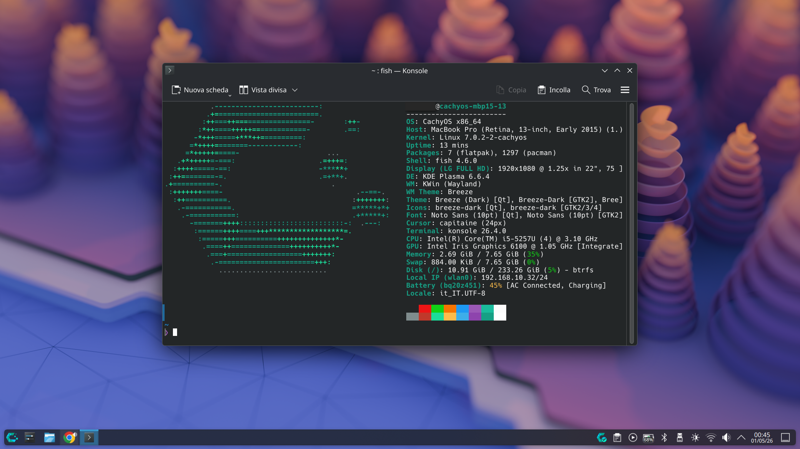

# ChayOS Configuration for Macbook Pro 2015 - 13"

<p align="center">
  
</p>

This repository provides a comprehensive post-installation script to perfectly configure **CachyOS** on a **MacBook Pro 2015 (A1502/A1398)**. It addresses specific hardware challenges such as Wi-Fi driver conflicts, battery longevity, and thermal management.

---

## ⚠️ Critical Installation Steps

To ensure the system works correctly and the script can execute without errors, you **must** follow this specific installation workflow:

### 1. Preparation with Ventoy
*   Create your bootable media using [Ventoy](https://www.ventoy.net/).
*   Copy the CachyOS ISO onto the Ventoy USB drive.

### 2. Bootloader Selection (Mandatory: GRUB)
*   **At Boot:** When you select the CachyOS ISO from the Ventoy menu, you must choose to boot via **GRUB**.
*   **At Installation:** During the CachyOS installation process (Calamares installer), you **must select GRUB** as your system bootloader. 
*   *Note: This script specifically modifies GRUB configuration files to fix hardware-level Wi-Fi issues.*

### 3. Required Hardware: USB Ethernet Adapter
*   **Why:** The MacBook Pro 2015 Wi-Fi drivers have a known conflict with the CachyOS kernel upon initial boot. 
*   **Requirement:** You must use a **USB-to-Ethernet adapter** during the entire OS installation and for the execution of this script. The script will verify your internet connection before proceeding to download necessary AUR dependencies.

---

## 🚀 Post-Installation Guide

Once CachyOS is installed and you have logged into your desktop:

1.  Plug in your **USB-to-Ethernet adapter**.
2.  Open your terminal.
3.  Clone this repository:
    ```bash
    git clone https://github.com/Mic87xp1/cachyos-config-mbp15.git
    cd cachyos-config-mbp15
    ```
4.  Make the script executable:
    ```bash
    chmod +x cachy_config_mbp2015_13.sh install_webcam.sh
    ```
5.  Run the optimization script:
    ```bash
    ./cachy_config_mbp2015_13.sh
    ```
6.  **Webcam Setup (Hardware Specific):**
    To enable the FaceTime HD camera, run the dedicated webcam script:
    ```bash
    ./install_webcam.sh
    ```
---

## ✨ Features of the Script

The `cachy_config_mbp2015_13.sh` script automates the following optimizations:

*   **Connectivity Check:** Ensures an active internet connection is present via Ethernet before starting.
*   **Automatic `yay` Bootstrap:** Compiles and installs the `yay` AUR helper directly from GitHub.
*   **Permanent Wi-Fi Fix:** Applies a dual-layer fix using both a `modprobe` configuration and a direct injection into the `GRUB_CMDLINE_LINUX_DEFAULT` to resolve `brcmfmac` stability issues.
*   **Power Optimization:** Executes `apple-battery-guard-setup-power` to harmonize system power management.
*   **Battery Health Preservation:** Automatically sets a **80% charge threshold** using `apple-battery-guard` to extend the physical lifespan of your battery.
*   **Thermal & Fan Management:** Installs and enables `mbpfan` with optimized curves for the MacBook Pro chassis.
*  **FaceTime HD Webcam Support:** Installs the necessary `facetimehd` DKMS drivers and firmware, configures auto-loading at boot, and fixes permissions for Flatpak apps like Vesktop.
*   **GUI Software Management:** Installs **Pamac (Add/Remove Software)** with AUR support enabled for a user-friendly experience.

---
*Disclaimer: This script is specifically tailored for CachyOS on MacBook Pro 2015 hardware. Use at your own discretion.*
